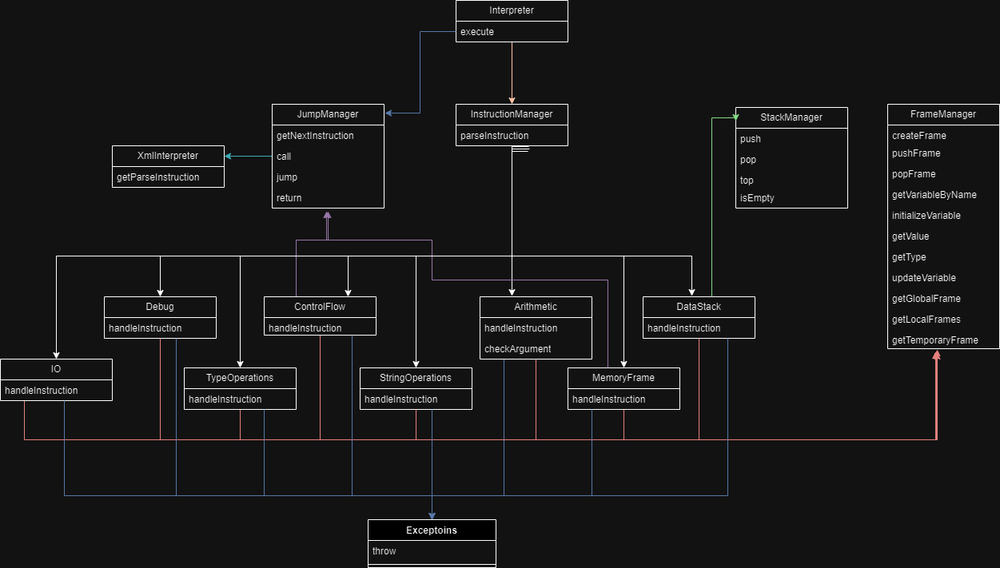

Implementační dokumentace k 2. úloze do IPP 2023/2024
Jméno a příjmení: Alexandr Tihanschi
Login: xtihan00

IPP Interpreter.php Documentation

Design Philosophy
The IPP Interpreter project is designed with a focus on simplicity, extensibility, and efficiency. The overall design philosophy revolves around creating a robust and flexible system capable of interpreting programs written in the IPP programming language. Key aspects of the design philosophy include:

Modularity: The interpreter is divided into modular components such as Parser, Instruction Classes, Frame Manager, Jump Manager, StackManager and Exception Handling. This modular design allows for easy maintenance, testing, and extension of functionality.

Error Handling: Robust error handling mechanisms are implemented to manage runtime exceptions and errors during program execution. This includes handling operand type errors, invalid operands, string operation errors, and other exceptional conditions.

Instruction Classes
Instruction Classes represent different types of instructions in IPP code, such as arithmetic instructions (ADD, SUB, MUL, DIV), control flow instructions (JUMP, JUMPIFEQ, JUMPIFNEQ), and string operations (CONCAT, STRLEN, GETCHAR, SETCHAR). Each instruction class encapsulates the logic for executing its respective operation.

Frame Manager, Jump Manager and Stack Manager
The Frame Manager component handles variable management and scope within the program. It tracks variables, their types, and values, ensuring proper handling of variable access and updates during program execution. The Jump Manager handles program flow control, including labels and jumps, enabling control flow operations to navigate the program’s execution path.The stack manager manages the stack for variables and contains basic stack instructions.

Uml diagram:

From the diagram you can see how instructions work with each other that the main entry point is InstructionManager, which provides a call to the corresponding function, and for correct work with memory stack jumps Methods of instruction classes use them to execute orders. Also classes about exceptions were implemented to simplify the work with incorrect data. This approach allows you to easily extend classes by adding new instructions, as the basis of managers provides quality work with the input code.

Working with IPPcore
When implementing the project I used IPPException to create new Exceptions, I also used methods to read input data, xml code and to write out data.

Testing
When testing my code, I used the tests from Discord where there were 363 tests in total. My code passes 323 of them, which I consider a good result
